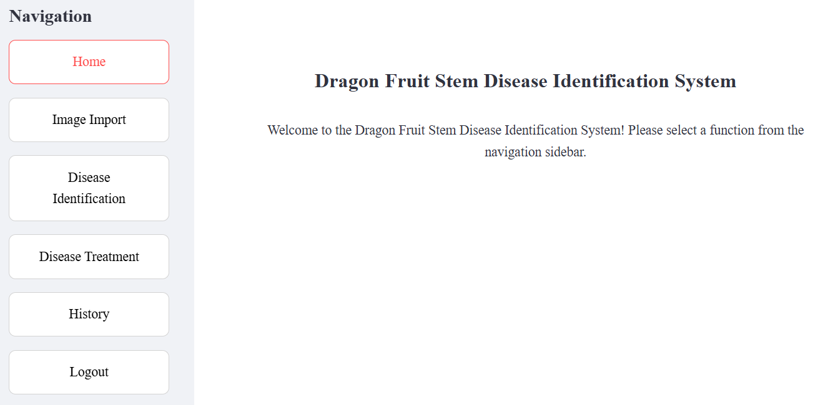

# Dragon Fruit Stem Disease Identification System

 <!-- Add actual screenshot path -->

An AI-powered web application for identifying diseases in pitaya (dragon fruit) plants using deep learning.

## Features

- **Image Analysis**: Upload or capture images of dragon fruit  stems
- **AI Identification**: ANDIFS model with ANDIFS-99.pth (92.22% accuracy)
- **Multi-Result Display**: Top 3 predictions with confidence percentages
- **Treatment Guides**: Detailed prevention and treatment methods
- **Performance Metrics**: Processing time tracking
- **History Tracking**: Save and review previous identifications
- **User Accounts**: Secure login system

## Technology Stack

- **Backend**: Python (PyTorch, Streamlit)
- **Model**: ANDIFS model with ANDIFS-99.pth
- **Frontend**: Streamlit web interface
- **Computer Vision**: OpenCV, PIL

## Citation

If using this system in research, please cite:
@misc{pitayaid2025,
  title={Dragon Fruit Stem Disease Identification System},
  author={Changyu Liu, Jiawei Pei, Fengrui Hao, Yazhou Ren, Guogang Huang, Jingjing Zheng, Hansheng Wang, Chunyin Wu, Aimin Wu
},
  year={2025},
  howpublished={GitHub Repository},
  url={https://github.com/cavey759/ANDIFS }
}

## Installation

1. **Clone the repository**:
```bash
git clone https://github.com/cavey759/ANDIFS.git
```


2. **Install dependencies**:
```bash
   pip install -r requirements.txt
```

3. **Activate the virtual environment of the project**:
```bash
   conda activate your_env_name
```

4. **Run application**:
```bash
   streamlit run frontend.py
```


